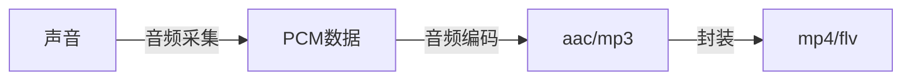
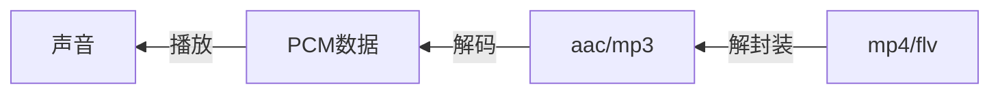
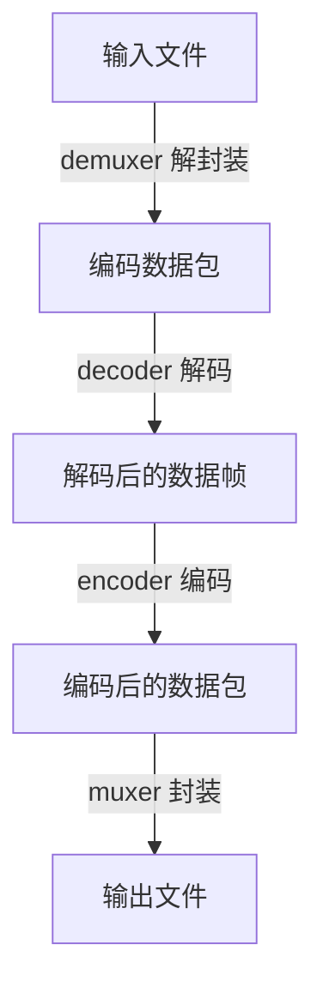

## 一、ffmpeg基础

### 1. ffmpeg介绍

ffmpeg既是一款音视频编解码工具，也是一组音视频编解码开发组件。

ffmpeg提供了多种媒体格式的封装和解封装，包括多种音视频编码、多种协议的流媒体、多种色彩格式转换、多种采样率转换、多种码率转换等。
&emsp;&emsp;同时ffmpeg框架提供了多种插件模块，包含封装和解封装的插件、编码和解码的插件等。

ffmpeg框架由5个基本模块组成。  

- 封装模块：AVFormat
- 编解码模块：AVCodec
- 滤镜模块：AVFilter
- 视频图像转换计算模块：swscale
- 音频转换计算模块：swresample

ffmpeg提供了如下3个工具。

- 编解码工具：ffmpeg
- 播放器：ffplay
- 多媒体分析器：ffprobe

### 2. 如何安装ffmpeg

#### 2.1 ubuntu下安装ffmpeg

##### 2.1.1 apt-get方式安装ffmeg

1. 添加源

   ```
   sudo add-apt-repository ppa:djcj/hybrid
   ```

2. 更新源

   ```
   sudo apt-get update
   ```

3. 下载ffmpeg

   ```
   sudo apt-get install ffmpeg
   ```

4. 查看ffmpeg安装路径和基本信息

   ```
   michael@ubuntu:~/ffmpeg$ whereis ffmpeg
   ffmpeg: /usr/bin/ffmpeg /usr/share/ffmpeg /usr/share/man/man1/ffmpeg.1.gz
   michael@ubuntu:~$ ffmpeg
   ffmpeg version 2.8.15-0ubuntu0.16.04.1 Copyright (c) 2000-2018 the FFmpeg developers
     *****省略多余信息*****
   Use -h to get full help or, even better, run 'man ffmpeg'
   ```

##### 2.1.2 源码编译ffmpeg

ubuntu发行版中已经包含了ffmpeg的安装包，但是可能版本比较老，对于一些新的编码格式和协议格式可能不支持，所以尽可能手动编译ffmpeg。

默认编译FFmpeg时，需要用到**yasm汇编器**对ffmpeg中的汇编部分进行编译。如果不需要用到汇编部分的代码，可以不安装yasm汇编器。如果没有安装该汇编器，执行默认配置的时候会报错。

```
michael@ubuntu:~/ffmpeg/package$ ./configure 
nasm/yasm not found or too old. Use --disable-x86asm for a crippled build.

If you think configure made a mistake, make sure you are using the latest
version from Git.  If the latest version fails, report the problem to the
ffmpeg-user@ffmpeg.org mailing list or IRC #ffmpeg on irc.freenode.net.
Include the log file "ffbuild/config.log" produced by configure as this 
will help solve the problem.
```

1. 编译安装yasm

```
wget http://www.tortall.net/projects/yasm/releases/yasm-1.3.0.tar.gz
./configure 
sudo make 
sudo make install
```

2. 安装xorg-dev和SDL这两个库（缺少这两个库，无法编译出ffplay）

注意：旧版本ffplay依赖于SDL 1.2，而新版本依赖于SDL 2.0，需要安装对应的SDL才能编译生成ffplay

```
sudo apt-get install xorg-dev
sudo apt-get install libsdl2-dev
```

3. 编译安装ffmpeg（ffmpeg源码可以到官网上下载，git下载比较慢）

```
git clone git://source.ffmpeg.org/ffmpeg.git ffmpeg
./configure
sudo make
sudo make install
```


**ffplay与ffplay_g的区别**

编译之后我们可以发现，文件夹中同时出现了ffplay与ffplay_g（还有ffmpeg与ffmpeg_g）。这个多出来的g是做什么的呢？

实际上，ffplay_g是含有调试信息的可执行文件，当我们想要调试时（比如新建一个工程对源码进行调试）会需要到它，而一般来说在实际使用的时候，我们会使用ffplay，它是ffplay_g经过strip之后得到的文件，这就是他们的区别。

#### 2.2 windows下安装ffmpeg


## 二、音频基础

### 1. 音频处理流程

采集到的音频数据是PCM数据，是转换后的数字信号

声音的采集过程：



声音的播放流程：



### 2. 声音的产生

声音是由物体振动产生的，可以通过气体、固体、液体等介质传递。

声音进入耳朵，使耳膜振动，大脑对其进行识别。

人的听觉范围是**20~20000Hz**，这个范围内的声音称为**可听声波**；小于20Hz的称为**次声波**，超过20000Hz的称为**超声波**。Hz是频率的单位，指1s内振动的次数。

### 3. 声音三要素

- 音调：音频的大小
- 音量：振动的幅度
- 音色：由谐波产生

### 4. 模数转换

对声音量化采样，将模拟信号转换为数字信号。

### 5. PCM和WAV

音频原始数据格式：

- PCM：纯音频数据
- WAV：在PCM数据基础上，加上了一个头部

量化基本概念：

- 采样大小（位深）：一个采样数据用多少bit存储，位深越大，表示音频范围越大。常用的是16bit
- 采样率：常用的有8K、16K、32K、44.1K、48K，采样率越高，数字信号和模拟信号就越接近
- 声道数：单声道、双声道、多声道
- 码率：采样率 * 采样大小 * 声道数

例如，采样率44.1KHz，采样大小16bit，双声道的PCM编码的WAV文件，它的码率是多少？

码率 = 44.1K * 16 * 2 = 1411.2 Kb/s

WAV头部：https://blog.csdn.net/zhihu008/article/details/7854529 

### 6. 音频采集

对于音频采集，不同的平台，如android、ios、windows和mac，有不同的API可供调用。而FFmpeg对于这些平台都做了封装，不需要区分具体平台，所以掌握ffmpeg的音频采集方式很重要。

可以通过命令行来采集音频数据。**自行上网查找相关资料，ubuntu下音视频采集的方法**

也可以通过API来采集音频数据，使用API采集音频的步骤如下。

 ```mermaid
graph LR

A[注册设备] --> B[设置采集方式]
B --> C[打开音频设备]
 ```

### 7. 音频压缩技术

音频压缩主要有两方面的考量，压缩的数据量和压缩的速度，直播需要综合考虑这两个方面

音频压缩技术包括有损压缩和无损压缩。

#### 7.1有损压缩

低于20Hz和高于20000Hz的数据，人耳感知不到，可以去除。

遮蔽效应，时间遮蔽和频域遮蔽，声音会被掩盖。

#### 7.2 无损压缩

熵编码

- 哈夫曼编码
- 算术编码
- 香农编码

#### 7.3 常见的音频编解码器

- **OPUS**：延迟小、压缩率高，是比较新的音频编解码器，webrtc中默认使用OPUS

- **AAC**：在直播中应用比较广泛，应用最广泛，音质保真性好

- Ogg：收费

- Speex：支持回音消除

- iLBC：

- AMR：

- G.711：用于固话

  评测结果：OPUS > AAC > Ogg


AAC编解码器，目的是取代MP3格式，压缩率更好，保真性好


AAC 格式:

- ADIF：只能从头开始解码，不能从音频数据中间开始。适合磁盘文件
- ADTS：每一帧音频数据，都有一个同步字，可以在音频的任何位置开始解码。类似于数据流格式

### 8. 音频重采样

音频三元组

- 采样率
- 采样大小
- 通道数

#### 8.1 什么是音频重采样

指的是将音频三元组的值转换成另一组值，如将44100 / 16 / 2转换成4800 / 16 / 2

#### 8.2为什么要进行重采样？

- 从设备采集的数据和编码器要求的数据不一样
- 要播放的数据和扬声器要求的数据不一致
- 便于计算

#### 8.3 如何判断是否要进行重采样

- 了解音频设备的参数
- 查看ffmpeg源码

#### 8.4 重采样步骤

- 创建重采样上下文
- 设置参数
- 初始化重采样
- 进行重采样

## 三、视频基础

### 1. 图像的基本概念

- 图像是由**像素**组成
- **像素**由红（R）、绿（G）、蓝（B）三原色组成
- **分辨率**：指显示器能显示的像素多少，X轴的像素个数 * Y轴的像素个数。常见的有：1280 * 720（720P）、1920 * 1080（1080P）、2048 * 1080（2K）、3840 * 2160（4K）
- **宽高比**：常见的宽高比有16:9 和 4:3。目前几乎都是16:9，如果宽高比不是16:9 或 4:3，需要将其转换为标准的16:9 或 4:3
- 描述分辨率的单位有：**dpi**（点每英寸）、**ppi**（像素每英寸）、**ppd**（角分辨率）
- ppi：每英寸包含的像素数目，ppi越高，图像更细腻。照片大约为300 ppi

### 2. 码流的计算

- **帧率**：每秒采集或播放图片的帧数。动画的帧率是25帧/s，常见的帧率有：15帧/s，30帧/s，60帧/s。对于实时通信而言，为了保证数据的实时性，可能会将帧率设置为15帧/s。**帧率越高，视频播放越平滑，清晰程度和分辨率有关**
- 未编码视频的RGB 码流大小 = 分辨率（宽 * 高） * 3（Byte）* 帧率
- **压缩率**：H264 码流压缩率大约为250倍，H265 码流压缩率大约为500倍

### 3. 图像的显示

图像的显示，需要考虑图像大小和显示区域大小的关系。

- 图像大小 == 显示区域大小，刚好显示
- 图像大小 < 显示区域大小，可以进行拉伸或留白
- 图像大小 > 显示区域大小，可以进行缩放或截取

### 4. YUV

#### 4.1 YUV 和 RGB的关系

- RGB用于图像的展示
- YUV用于采集和编码

#### 4.2 YUV和RGB的转换

#### 4.3 YUV的常见格式

- YUV  4 : 4 : 4
- YUV  4 : 2 : 2
- YUV  4 : 2 : 0

### 5. H264

#### 5.1 压缩码率

#### 5.2 GOP

#### 5.3 I帧、P帧、B帧

#### 5.4 宏块

#### 5.5 帧内压缩

#### 5.6 帧间压缩

#### 5.7 无损压缩

#### 5.8 H264码流结构


## 四、ffmpeg命令

### 1. 命令分类

- 基本信息查询命令
- 录制命令
- 分解 & 复用命令（格式转换）
- 处理原始数据命令
- 裁剪与合并命令
- 图片与视频互转命令
- 直播命令
- 滤镜命令

### 2. ffmpeg处理音视频流程



### 3. 基本信息查询命令

| 命令         | 说明                          |
| :----------- | :---------------------------- |
| -version     | 查看版本                      |
| -demuxers    | 查看可用的解封装器（demuxer） |
| -muxers      | 查看可用的封装器（muxer)      |
| -devices     | 查看可用的设备                |
| -codecs      | 查看可用的编解码器            |
| -decoders    | 查看可用的解码器              |
| -encoders    | 查看可用的编码器              |
| -bsfs        | 查看比特流 filter             |
| -formats     | 查看可用的格式                |
| -protocols   | 查看可用的协议                |
| -filters     | 查看可用的滤镜                |
| -pix_fmts    | 查看可用的像素格式            |
| -sample_fmts | 查看可用的采样格式            |
| -layouts     | 查看channel名称               |
| -colors      | 查看颜色名称                  |

### 4. 录制命令

ffmpeg 在 linux下支持多种采集设备，包括 **fbdev**、**v4l2**、**x11grab**

查看支持的设备列表

```
machun@ubuntu:~/tmp$ ffmpeg -devices
```

- fbdev：用于图像展示操作
- v4l2：采集摄像头数据
- x11grab：录制屏幕

#### 4.1 桌面

```
ffmpeg -f x11grab -s 1920x1080 -r 25 -i :0.0+0+0 luping.mp4
```

#### 4.2 摄像头

#### 4.3 麦克风

#### 4.4 摄像头 + 麦克风

#### 4.5 桌面 + 麦克风


